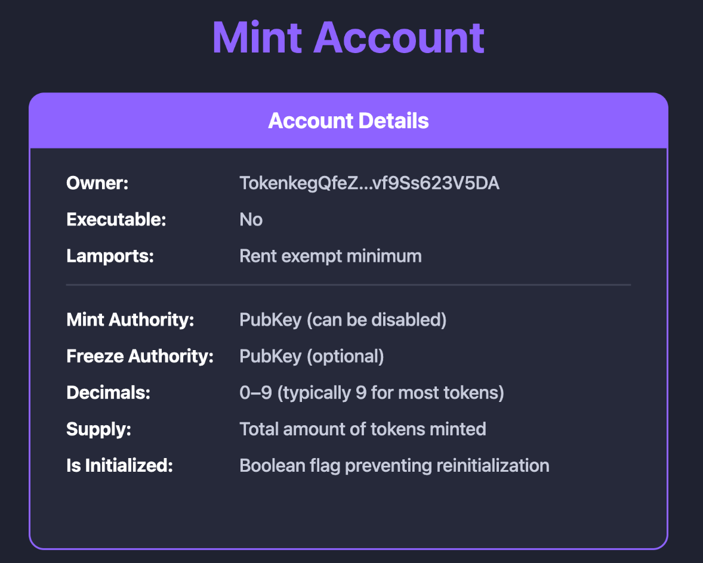
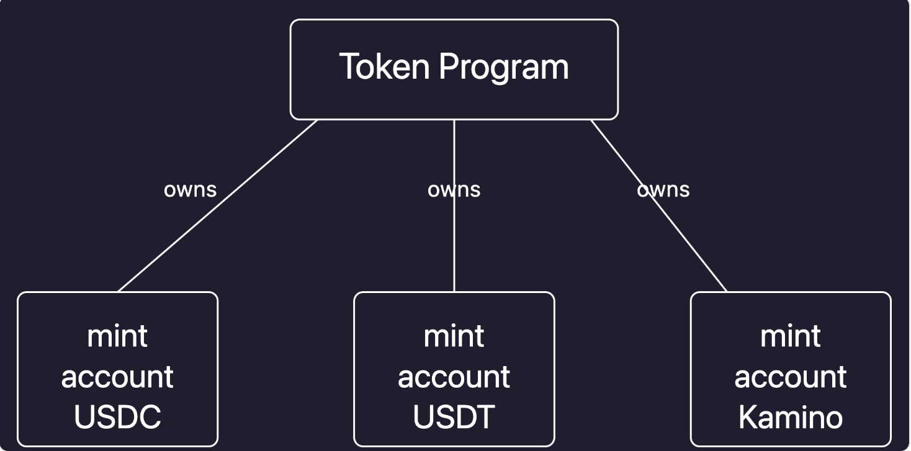
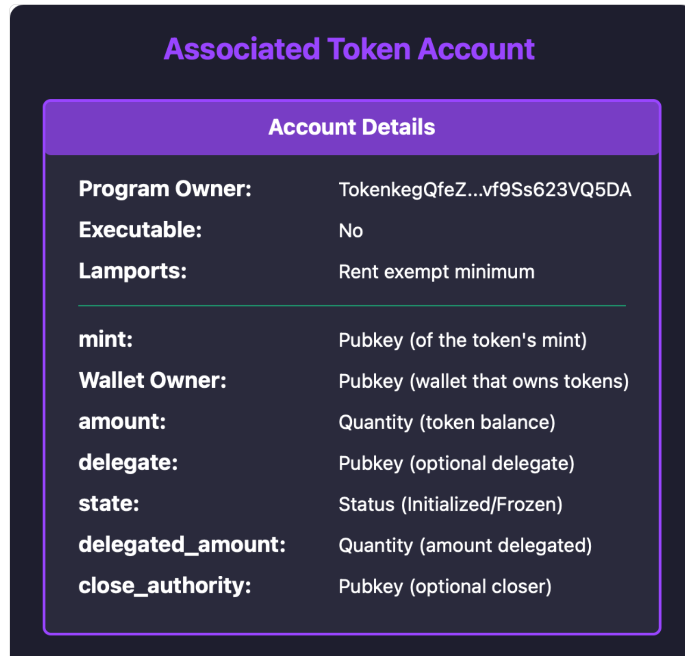

# 账户模型

## 组成

- Mint Account
- Associated Token Accounts(ATA)

## Mint Account

- 存储代币的基本信息
  
  例子
  

## ATA

- 可以追踪用户有多少某种代币 类似于`user1有usdc 100个`
- 推导方法
  `user_wallet_address + token_mint_address => associated_token_account_address`

